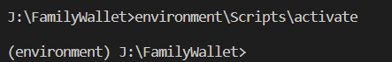
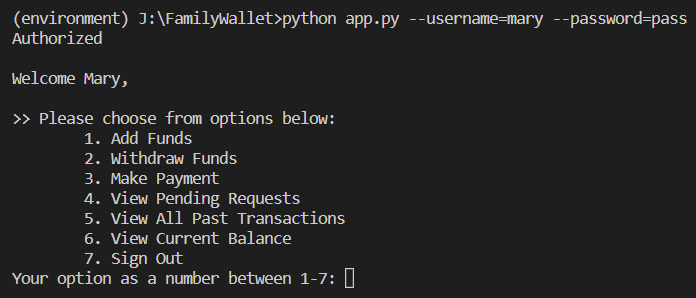

# Family Bank Wallet

> A bank wallet App for a family that runs on console.

## Description
This project is a bank wallet application for a family consisting of Mom, Dad and Children. Children have limited access to the wallet with respect to how much they can spend and how often, while their parents have no limit to purchases, view past transactions and can also add funds to the wallet. A minimum balance is required to spend money and system notifies parents when the wallet balance drops below $100. 

## Development Requirements
1. It is always recommended to use a virtual environment while developing Python applications. A virtual environment allows you to create a “virtual” isolated space to install packages. As the packages installed are local to that directory and not globally installed, you can simply create a new virtual environment and not have to worry about breaking the packages installed in the other projects or environments. If you still unclear about using a virtual environment read this [post](https://realpython.com/python-virtual-environments-a-primer/) to get a better understanding.<br>
<b>Before creating a virtual environment, clone the project and move inside the directory</b><br>
Once all the code are successfully moved, create a new virtual environment following the steps below:
```
# To install the package
python -m pip install --user virtualenv
```
```
# To create a new virtual environment with name 'environment'
python -m venv environment
```
```
# To activate the environment move into the project directory and run the following command
.\environment\Scripts\activate
```
On successfully activating the environment you will see a screen like this:<br>


2. This project requires [Click](https://click.palletsprojects.com/en/8.1.x/), a python package for creating CLI (command line interface) and a virtual environment to run the code.<br> (NOTE: Create and installing this package inside the virtual environment)
You can get the click library directly from PyPI:
```
python -m pip install click==8.1.3
```

## Installing and Running the project
Clone this repo and run app.py file to open the wallet. You have to provide username and password to signin to the account. Profile related info can be found in users.json file. New user accounts can be created by adding new objects to users.json file. 


## License
[MIT](https://choosealicense.com/licenses/mit/)
